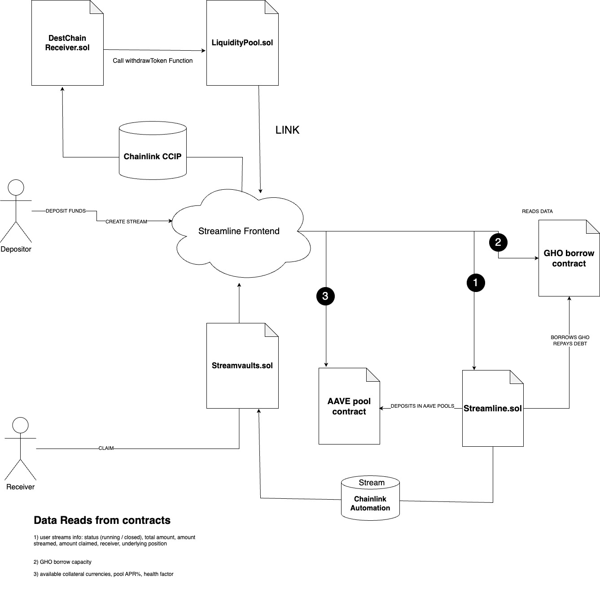

### Streamline Architecture

  

### StreamLine Contract
StreamLine Address: 0x63FDDFC18E900D6f252238dF0f232018C212D22D
StreamLine Deploy On Sepolia: https://sepolia.etherscan.io/address/0x63fddfc18e900d6f252238df0f232018c212d22d#readContract

### StreamVaults Contract
StreamVaults Address: 0xf0096580d64a7A3b30fa433731ADc78a8DA9A001
StreamVaults Deploy On Sepolia: https://sepolia.etherscan.io/address/0xf0096580d64a7A3b30fa433731ADc78a8DA9A001#readContract

### DestChainReceiver Contract
DestChainReceiver Address: 0x72A01405437f348ACF2a4a498DcD303902E1557D
DestChainReceiver Deploy On Polygon Mumbai: https://mumbai.polygonscan.com/address/0x72a01405437f348acf2a4a498dcd303902e1557d#code

### LiquidityPool Contract
LiquidityPool Address: 0xc01cC5Ad3C89e26301bB2cfce87a515A6e80DBb5
LiquidityPool Deploy On Polygon Mumbai: https://mumbai.polygonscan.com/address/0xc01cc5ad3c89e26301bb2cfce87a515a6e80dbb5#code

### Etherscan / polygonscan Test DEMO
#### StreamLine Video:  https://www.youtube.com/watch?v=mJaIkzzZW-Y
#### StreamVaults and Cross Chain Video:  https://www.youtube.com/watch?v=9tGVE-GPPxE

### Check Status on Chainlink 
#### Chainlink Automation Status: 
https://automation.chain.link/sepolia/88520497691709347783514887032752104320864026698858233368798223558543343212584
#### Cross Chain Status: 
https://ccip.chain.link/msg/0x1a8c8cf4eb671e663e76e54383cafba8d90627d06e505f822a692c9ea5790bcc

